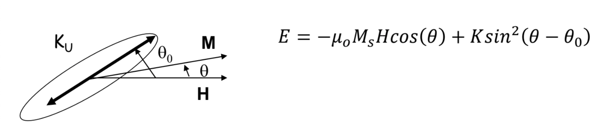

 The goal of this project is to simulate a system with two spins under an applied field. We are interested in plotting a hysteresis loop. The mechanics of this system can be better understood through the reading provided in the respective subsection. A simple GUI is implemented to allow users to vary parameters of the simulation. 

# Single Spin System (Uniaxial Case)

 The process of plotting the hysteresis loop of a single spin system is as follows:

<ul> 
  <li>Define an anisotropic axis angle.</li>
  <li>Define a range of field strengths H to apply.</li>
  <li>Locate the energy where the angle in which the energy is at a minimum for an applied field strength of 0T. This is the uniaxial angle - If there are two angles that corrospond to a minimum take the first angle found. </li>
  <li> Calculate the energy value of the system at an applied non-zero field strength, and track the evolution of this minimum with respect to the uniaxial angle minimum. If an inflection point is encontured before a minimum is found, include this in the tracking.  </li>
  <li>Repeating this process for increasing H fields and decreasing H fields will yield two different curves. </li>
  <li> Plot the cosine of the minimum field angles with respect to the applied field strength to produce a hysteresis loop.</li>
</ul>

 

# Two Spin System 

 A two spin system is to be simulated to model is to be implmented with the motivation to investigate a bilayer thin film system (As outlined in Folekrts et al 1990).

We are interested in the the anti-ferromagnetic coupling exchange energy

<ul>
<li>In total there are three equations this simulation will consider</li>
<li> Zeeman Energy: -0.5 * H * M cos(phi_1 + phi_2)</li.>
<li> Exchange (Coupling Term): - J_AF * cos(phi_2 - phi_1) </li>
<li> Anistrotropy Energy (Cubic Symmetry, [001] growth):(0.125) * K1 * (Sin^2(2 * phi_1) + Sin^2( 2 * phi_2))</li> 
</ul>

By considering the LLG solution the system we can create more sophisticated (and more accurate ouput)
=======
## This repo only contains a working simulation of a **one** spin system. 2 spins is currently being developed (as of 6/30/23). 
